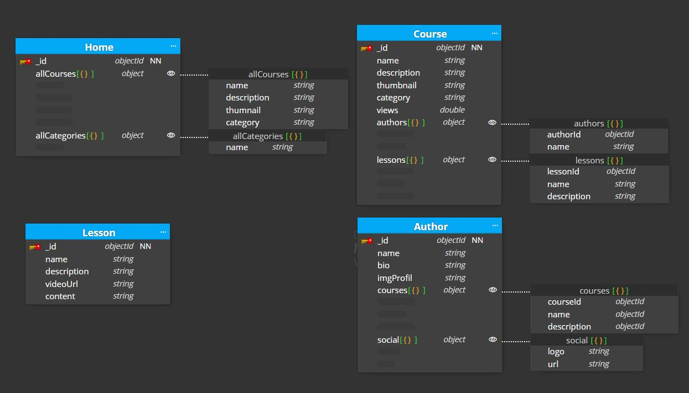
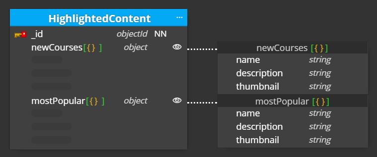
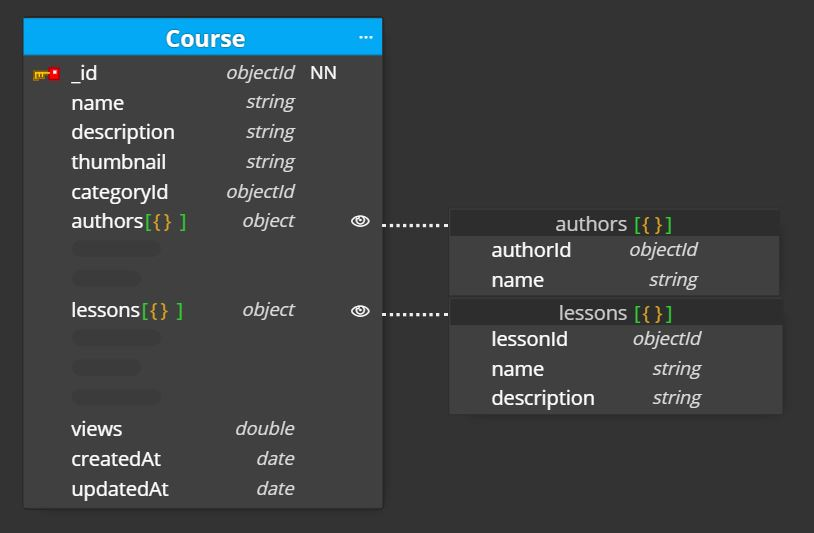

# Modul 1 - Lab Practice

## First Approach

    

### Home Collection

Upon loading the application, the backend returns a collection of all courses and categories.

- The course collection includes `name`, `description`, `thumbnail`, and `category`.
- The category collection includes only the `name` property, which will also serve as a unique identifier.

> The backend will apply **Extended Reference** to the _Course_ collection, since it only requires a subset of the available properties for each course, `name`, `description`, `thumbnail`, and `category`.

### Course Collection

When accessing a course, the backend retrieves `name`, `description` and `thumbnail` properties from the course object. The application needs to display the course authors, so an array of authors is necessary. Additionally, the application needs to display all lessons for the course, so an array of lessons is required. The course has a `category`, and if the application wants to show the most visited courses, a counter `views` is also necessary.

- From the authors, the application only requires `name` and an `id` to navigate to the _AUTHOR_ page.
- From the lessons, the application only requires `name`, a `description`, and an `id` to navigate to the lesson page.

> The application will apply **Extended Reference** to the _Author_ collection since it only needs the `id` and `name`. Similarly, it will also apply **Extended Reference** to the _Lesson_ collection since it requires only the `id`, `name`, and a `description`.

> The application could apply **Computed Pattern** to the `views` counter since the data does not need to be updated in real-time. It could be calculated once an hour or once or twice a day.

### Lesson Collection

Each lesson has a `name` and a `description`. In addition, the application needs to show the video using a `videoUrl` and display the lesson content in markdown using `content`.

### Author Collection

The author page shows the professor's `name`, profile image `imgProfile`, a `bio`, a list of courses where the professor appears as an author courses, and a social media bar, which will be an array of objects `logo` and `url`.

From the courses, the application only requires the `courseId` to navigate to the course, as well as the `name` and `description`.

> The application will apply **Extended Reference** to the _Course_ collection since it only needs the `courseId`, `name`, and `description`.

## Second Approach: Application Improvement

### 1. Create HighlightedContent Collection

This collection will display a list of the 5 most recent and 5 most popular courses. This can be checked once or several times a day along with updating the number of course views.

    

### 2. Home Collection

- `allCourses` will have a `categoryId`. In this way, there will be no problems if for some reason the category names are changed.

    

### 3. Add date properties to _Course_

To be able to group courses by the most recent, we need to keep a record of when the course was created. It would also be good to store when there was an update to the course.

    

### 4. Apply **Subset Pattern** to categories

This will be applied to the different categories to show only the latest 5 videos published instead of loading all courses. When there are 100 courses, it doesn't make sense to load all 100 courses every time we open the application.

### 5. Caching data

Once the number of course views is updated, we could cache the 5 most popular videos per category as well as the most recent and most popular courses.

### 6. Lessons

To improve the response time of the application by temporarily storing data in the cache instead of constantly calling the server, we can cache the content of the courses since this page will have a high frequency of use.

### Diagram final result

    

- Author-Course. The relationship is `many-to-many` as a course can have one or multiple authors, and an author can have one or multiple courses.

- Category-Course. The relationship is `one-to-many`. A category can have one or multiple courses, while a course has only one category.

- Home-Course. The relationship is `one-to-many`. Home has several courses, while courses only relate to one home.

- Course-Lesson. The relationship is `one-to-many`. A course can have one or multiple lessons, while a lesson is only associated with one course.

- HighlightedContent-Home. The relationship is `one-to-one`. There is only one collection of highlighted content for a single home collection.
